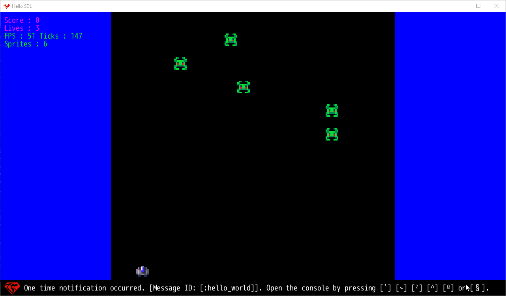

Shooting Game made in DragonRuby GTK

This is a very basic shooting game made to understand usage of [DragonRuby GTK](https://dragonruby.itch.io/dragonruby-gtk).
DragonRuby GTK is an amzing game engine for Windows, Mac & Linux which uses Ruby for programming.
Here are some features copied from the official website:

* Dirt simple apis capable of creating complex 2D games.
* Fast as hell. Powered by highly optimized C code written by Ryan C. Gordon, the creator of SDL (a library that powers every commercial game engine in the world).
* Battle tested by Amir Rajan, a critically acclaimed indie game dev.
* Tiny. Like really tiny. The entire engine is a few megabytes.
* Hot loaded, realtime coding, optimized to provide constant feedback to the dev. Productive and an absolute joy to use.
* Turn key builds for Windows, MacOS, and Linux with seamless publishing to Itch.io.
* Cross platform: PC, Mac, Linux, iOS, Android, Nintendo Switch, XBOX One, and PS4 (mobile and console compilation requires a business entity, NDA verification, and a Professional GTK License, contact us).